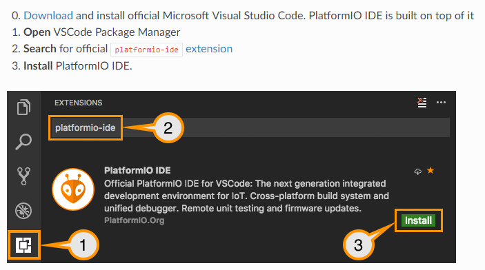

# This is a tutorial for uploading the right codes into RoboTommy

## Install PlatformIO

    
    
<figure>
    
    <figcaption></figcaption>
</figure>

## First the calibration code for the ESP
 
Go to : File (left upper corner), open folder, then go to RoboTommy, Software, and open the file  ESP8266_test_calibration 

then connect your computer to the ESP on RoboTommy !!! MAKE SURE THAT IT IS A DATA CABLE !!!
make sure that RoboTommy is standing on a flat surface, then
on the blue line select: Upload - please
wait till the upload is done,
then look on the terminal - do not turn the robot off, until it finishes calibrating !
once it finishes calibrating, go on to the next step

## The actual code for ESP

Go again to : File, open folder, RoboTommy, Software, but this time select ESP8266
upload the code to the ESP (the terminal will say SUCCESS)

Congratulations! the ESP is ready to go. Now there is only the arduino left!

## The ArduinoNano code

Again go to : File, open folder, RoboTommy, Software, and select the file ArduinoNano
upload the code, but beware : this time you have to upload it to the ArduinoNano (it has a different cable by the way)
when the upload is finished, all the work here is done. Good job! :)

